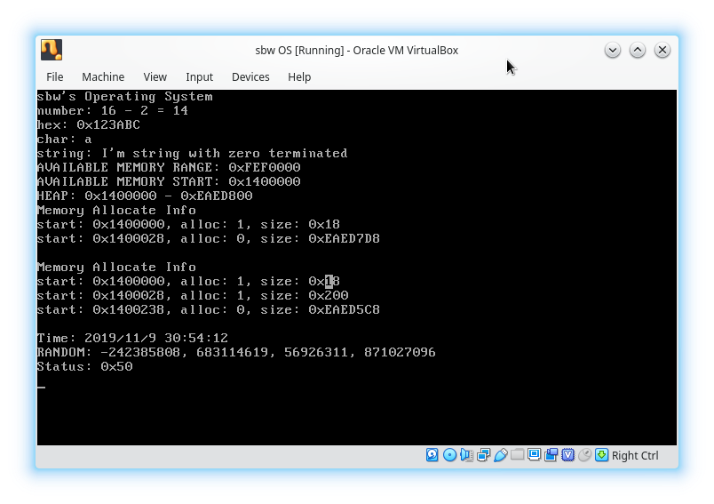

# SOS - sbw's Operating System
It's just a toy for learning OS technology.

# Build from source

## Build dependencies

### Archlinux
```
pacman -S g++ cmake grub xorriso mtools
```

### Extra build dependencies on Debian/Ubuntu
- grub-pc-bin

### Windows
Using `Cygwin` to install following dependency tools:
- mingw
- cmake
- make
- xorriso

## Build
__Must using g++/MinGW as compiler, clang or other else is NOT support yet.__
```shell
mkdir build
cd build
cmake -DCMAKE_CXX_COMPILER=g++ -DCMAKE_ASM_COMPILER=g++ ..
make # or ninja when using Ninja as generator
```

When build done, you can found `sos.iso` and `sos_kernel` in your build dir.

`sos.iso` is a bootable image so you can start from it using VirtualBox or QEMU.

# Try SOS in QEMU emulator

## Runtime dependencies
- QEMU

## Run

### Basic
```shell
qemu-system-x86_64 -boot d -cdrom sos.iso -m 256
```

### Enable KVM & IOMMU (Intel VT-d/AMD-Vi) support on Linux
```shell
qemu-system-x86_64 -enable-kvm -machine q35,accel=kvm -device intel-iommu -cpu host -boot d -cdrom sos.iso -m 256
```

### Enable HAXM on Windows
```shell
qemu-system-x86_64 -accel hax -boot d -cdrom sos.iso -m 256
```

# Screenshots


# License
This project is licensed under the [MIT](LICENSE) license.
