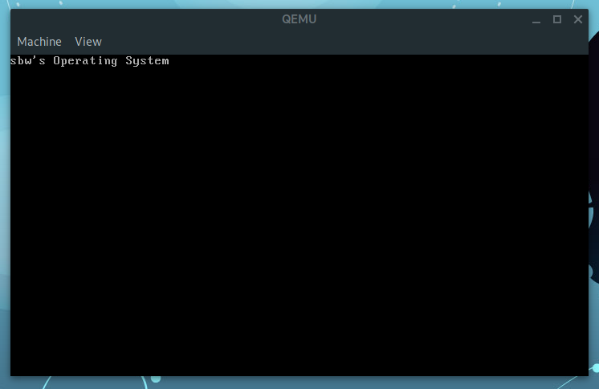

# SOS - sbw's Operating System
It's just a toy for learning OS technology.

# Build from source

## Build dependencies
- g++
- cmake
- grub-mkrescue
- xorriso

## Build
Must using g++ as compiler, clang++ or other else is not support yet. for using Ninja as generator, just add argument `-G "Ninja"` in cmake commandline.
```shell
mkdir build
cd build
cmake -DCMAKE_CXX_COMPILER=g++ -DCMAKE_ASM_COMPILER=g++ ..
make # or ninja when using Ninja as generator
```

## Runtime dependencies
- QEMU

## Run
```shell
make launch-qemu
```

# Screenshots


# License
The MIT License
